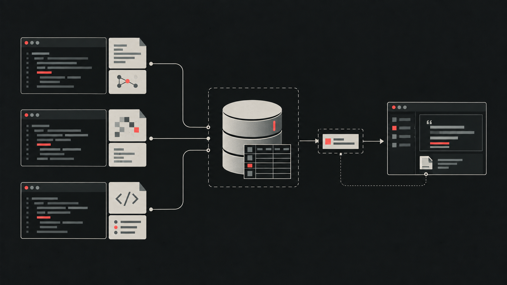

# Agent Mem

Local memory for coding agents.

Agent Mem captures source events from configured Codex CLI, OpenCode CLI, and GitHub Copilot CLI worktrees. Original text, spans, timestamps, sessions, and provenance are stored in SQLite. Retrieval is available through stdio MCP and a local IPC broker.



## Quick start

Requirements: Node.js 24.20.x, npm 11, and a local project or worktree.

macOS / Linux:

```sh
curl -fsSL https://raw.githubusercontent.com/Abuarchiv/agent-mem/main/install.sh | sh -s -- --project "$PWD"
agent-mem install --project "$PWD" --agents codex --yes
agent-mem view
```

The installer verifies the package checksum, configures the selected host, starts the local broker, and verifies MCP initialization. The viewer command prints a local URL.

For Codex, open `/hooks`, trust the project hooks, and reopen the project. Capture starts after the hook is trusted.

## Viewer

The viewer is read-only and defaults to **All projects**.

It shows:

- sessions, source events, spans, jobs, memory records, privacy state, and query traces;
- measured evidence reduction and token savings without imposing a webpage token budget;
- a real interactive knowledge graph with scope, session, source, and source-backed semantic nodes.

The page receives an embedded local snapshot. It has no REST API and does not write to the vault.

## Retrieval

The local core works without a generative model or provider API:

- SQLite FTS5 for lexical search;
- bundled multilingual E5 for semantic retrieval;
- optional local reranking;
- four stdio MCP tools: `memory_recall`, `memory_get`, `memory_forget`, and `memory_write`.

## Data and privacy

The vault is local, but it is not encrypted at rest. Anyone who can read the data directory or its backups can read the stored evidence. A host may also send recalled text to its own model provider.

The default data directory is:

```text
~/Library/Application Support/Agent Mem   # macOS
~/.local/share/Agent Mem                   # Linux
%LOCALAPPDATA%\Agent Mem                   # Windows
```

Use `--data-dir /absolute/path` for another location.

## Useful commands

```sh
agent-mem status --json
agent-mem pause
agent-mem resume
agent-mem extras list
agent-mem extras install reranker
agent-mem repair --project "$PWD"
```

## Development

```sh
npm ci --ignore-scripts
npm run models:download
npm run models:verify
npm run build
npm test
```

This checkout is an engineering preview. The local-first core is the supported V1 path; host surfaces and release targets require separate runtime verification.
